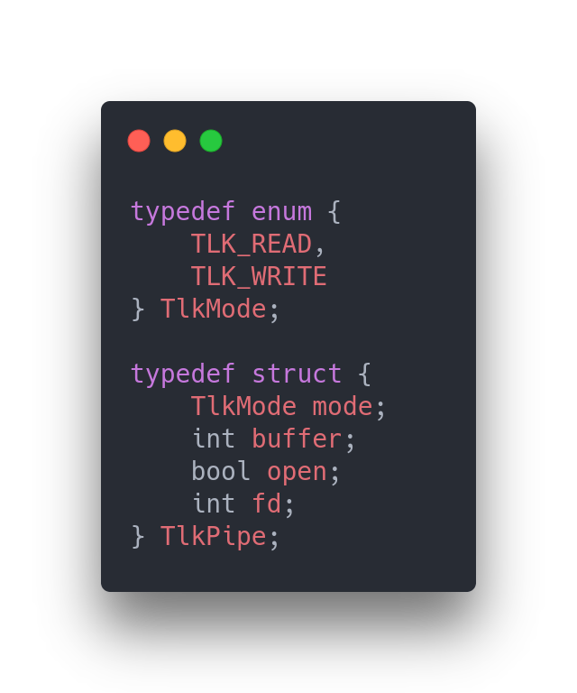

# Gomoku Manual (PL)

## Kompilacja

> **Uwaga**
> Program korzysta z biblioteki GTK+ 3.0

Wystarczy wykonać komendę `make`

## Krótka dokumentacja

Program otwiera się na ekranie menu, na którym po wybraniu kolor gracza - gra automatycznie tworzy *lobby* i oczekuje na dołączenie do gry przez drugiego gracza. Drugi gracz nie będzie miał możliwości stworzenia własnego lobby, ponieważ program wykryje, że już jedno *lobby* istnieje w danym folderze (Lobby jest named pipe'em).

Rozgrywka toczy się turowo. Zaczyna gracz czarny. Zawodniczy grają nawzajem dopóki:

1. Plansza się zapełni

2. Któryś z graczy wyjdzie z gry

3. Wygra któryś z graczy

Celem gracza jest ułożenie 5 pionków w poziomie, pionie lub skosie. Gra zależna jest od   obrazków oraz pliku CSS.

## Architektura programu

Program składa się z następujących modułów:

- **game** - moduł obsługujący mechanizm rozgrywki, sprawdzania, czy któryś z graczy wygrał oraz podsumowywania rozgrywki odpowiednim opisem stanu gry.

- **gtkui** - moduł ułatwiający programowanie z biblioteką w GTK+ 3.0. Napisany został przeze mnie i kolegę z grupy. Chcieliśmy zbudować czysty i przejrzysty kod, dla większej czytelności i zwiększonej wydajności pracy. Moduł ten jest udostępniony publicznie i można przejrzeć jego zawartość pod tym linkiem: [GTK-UI](https://github.com/Ph0enixKM/GTK-UI)

- **include** - moduł zawierający glabalny plik nagłówkowy z którego inne moduły korzystają by móc otrzymać dostęp do niektórych funkcji z innych modułów oraz zmiennych globalnych. Ponad to zawiera funkcje alokowania pamięci oraz uwalniania jej na początku i pod koniec programu.

- **lobby** - moduł obsługujący całą strukturę behawioralną lobby oraz dołączania do istniejącego lobby. Ponad to zawiera również funkcję konstuującą ów lobby.

- **menu** - moduł obsługujący cały mechanizm związany z menu, jego interfacem oraz interakcją użytkownika.

- **talk** - moduł umożliwiający komunikację między programami. Moduł używa named pipe (FIFO) do komunikacji. Nie każdą funkcję użyłem w tym module, ponieważ pisałem go na wyrost przed zabraniem się za cały projekt, żeby przygotować sobie dobre fundamenty.

- **utils** - moduł zawierający funkcje które nie koniecznie są związane z jakimś modułem, albo uznałem, że nie pasują do żadnego.

- **save** - moduł zawierający funkcje które odpowiadają za zapis i odczyt stanu gry.

### Struktury

Nie korzystałem z wielu struktur, ponieważ udało mi się wiele problemów rozwiązać bez ich potrzeby. Przykładem może być chociaż by przesył danych między programami. Wykonałem go korzystając z tablicy charów zamiast przesyłając strukturę. Dało mi to między innymi większą swobodę do debugowania mojego programu.

- Struktura **Pos**

    

Zawiera ona informacje o pozycji polu na planszy. Wykorzystywana jest przy sprawdzaniu czy pewne dokładnie 5 pól spełniają oczekiwania wygrania rozgrywki przez pewnego gracza w funkcji `playerCheck()` w pliku *game/check.c*. Każde takie pole jest zapisywane w tablicy globalnej *trace*. Z niej korzysta funkcja `gameOver()` w pliku *game/game.c* która podświetla pola zwycięzcy pod koniec gry.

- Struktura **TlkPipe**

    

Zawiera ona informacje o aktualnie otwartym named pipe'u. Są to informacje takie jak: tryb otwarcia (zapis, odczyt), rozmiar bufora, stan otwarcia oraz deskryptor pliku (file descriptor). Struktura ta jest ściśle wykorzystywana przez funkcje związane z modułem **talk**. W Headerze tego pliku możemy zauważyć komentarze, które odnoszą się do funkcji korzystających z tej struktury. Reszta funkcji działa tak, że otwierają, zapisują lub odczytują a następnie zamykają named pipe'a (Nie koniecznie wszystkie mi były potrzebne podczas rozwoju mojego programu).

### Funkcje

Program korzysta z wielu funkcji.  Nie będę omawiać wszystkich, ponieważ niektóre są to funkcje wykonujące drobne, czasem wręcz oczywiste operacje. Inne są zaś callbackami funkcji macierzystych, które właśnie zamierzam przedstawić.

> Plik *main.c*

- Zaczynając od funkcji `main()`, która jest najważniejszą funkcją w całym programie. Wywołuje ona funkcje najwyższego poziomu tj. 
  
  - Inicjalizowanie globalnych zmiennych
  
  - Ładowanie pliku stylów CSS (którą zaimplementowałem w **GTK-UI**)
  
  - Tworzenie głównego okna
  
  - Tworznie stacku który jest odpowiedzialny za przełączanie scen 
    *(takich jak menu, game, wait)*
  
  - Konstruowanie sceny Lobby
  
  - Konstruowanie sceny Menu
  
  - Przełączenie się na scenę Menu
  
  - Podłączanie głównego okna do eventu *destroy* 

> Plik *menu/menu.c*

- Funkcja `createMenu()` konstruuje menu tworząc logo, oraz dodawając stack jako drugi widget w tej scenie. W tym stacku przechowywane są dwie podsceny - host oraz join.
  
  - **host** - zawiera wybór między dwoma kolorami pionków - biały lub czarny. Wybór powoduje stworzenie się lobby oraz przełączenie użytkownika na ekran oczekiwania na drugiego gracza.
  
  - **join** - zawiera przycisk dołączający do rozgrywki. Po naciśnięciu w ten przycisk program podłączy się do istniejącego lobby i rozpocznie rozgrywkę.
  
  Warto wspomnieć, że istnieje funkcja która co jakiś czas sprawdza, czy czasem nie istnieje lobby. W takim przypadku przełącza stack na **join**. Natomiast jeśli lobby zniknie (patrz: host wyłączy okno tym samym usunie lobby) - stack użytkownika drugiego automatycznie to wykryje i przełączy stack na **host**.

> Plik *game/game.c*

- Funkcja `createGame()` kosntruuje wygląd rozgrywki jednocześnie podpinając odpowiednie callbacki do różnych pól. Plansza jest tworzona przy pomocy widgetu grid w zmiennej *ui_grid*. Inna globala zmienna użyta w tej funkcji to *ui_status*, która zawiera informacje o stanie gry. To czy któryś z graczy wygrał, czy plansza się zapełniła, czy któryś z graczy odszedł od gry - to wszystko jest pokazywane przy pomocy tego widgetu. Ponad to globalnie przechowuję dwie tablice:
  
  - **fields** - przechowuje dane na temat tego gdzie użytkownik położył pionek i jakiego on jest koloru
  
  - **btns** - przechowuje wszystkie widgety z planszy (buttony) które są później wykorzystywane m.in. do podświetlania pól.

> Plik *game/check.c*

- funkcja `gameCheck()` sprawdza po pierwsze czy plansza jest pełna, a następnie przechodzi do sprawdzania czy któryś z graczy wygrał. Do tego wykorzystuje funkcję `playerCheck()` która jest zamieszczona w tym samym pliku. Funkcja ta iteruje w każdy możliwy sposób (tj. pion, poziom i ukosy) by sprawdzić czy dany gracz wygrał czy przegrał.

## Podsumowanie

Ten projekt sprawił, że prawdziwie polubiłem język C. Jest to mój pierwszy poważny projekt, który napisałem w tym języku i od razu polubiłem swoistą minimalistyczność C. Co prawda były momenty kiedy tęksniłem za obiektowym paradygmatem, ale w pewnym momencie zrozumiałem, że tak naprawdę to wszystko siedzi w głowie.

*Paweł Karaś*

